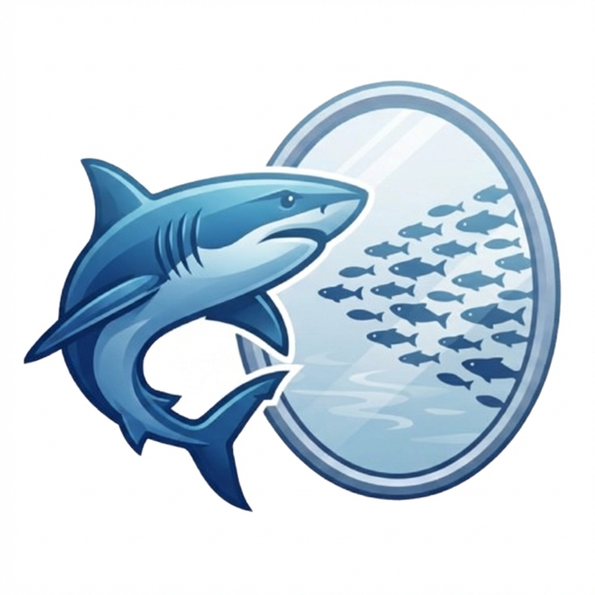

<p align="center">
  
</p>

<h1 align="center">MiroShark</h1>

<p align="center">
  <a href="https://github.com/aaronjmars/MiroShark/stargazers"></a>
  <a href="https://github.com/aaronjmars/MiroShark/network/members"></a>
  <a href="https://x.com/miroshark_"></a>
  <a href="https://bankr.bot/discover/0xd7bc6a05a56655fb2052f742b012d1dfd66e1ba3"></a>
</p>

<p align="center">
  <strong>Universal Swarm Intelligence Engine — Run Locally or with Any Cloud API</strong><br>
  Multi-agent simulation engine: upload any document (press release, policy draft, financial report), and it generates hundreds of AI agents with unique personalities that simulate public reaction on social media — posts, arguments, opinion shifts — hour by hour.
</p>

<p align="center">
  
</p>

<p align="center">
  
</p>

<p align="center">
  
</p>

<p align="center">
  
</p>

---

## How It Works

1. **Graph Build** — Extracts entities and relationships from your document into a Neo4j knowledge graph. NER uses few-shot examples and rejection rules to filter garbage entities. Chunk processing is parallelized with batched Neo4j writes (UNWIND).
2. **Agent Setup** — Generates personas grounded in the knowledge graph. Each entity gets 5 layers of context: graph attributes, relationships, semantic search, related nodes, and LLM-powered web research (auto-triggers for public figures or when graph context is thin). Individual vs. institutional personas are detected automatically via keyword matching.
3. **Simulation** — All three platforms (Twitter, Reddit, Polymarket) run simultaneously via `asyncio.gather`. A single LLM-generated prediction market with non-50/50 starting price drives Polymarket trading. Agents see cross-platform context: traders read Twitter/Reddit posts, social media agents see market prices. A sliding-window round memory compacts old rounds via background LLM calls. Belief states track stance, confidence, and trust per agent with heuristic updates each round.
4. **Report** — A ReACT agent writes analytical reports using `simulation_feed` (actual posts/comments/trades), `market_state` (prices/P&L), graph search, belief trajectory, and Nash equilibrium tools. Reports cite what agents actually said and how markets moved.
5. **Interaction** — Chat directly with any agent via persona chat, send questions to groups, or **branch the simulation with a counterfactual event** at any round to explore "what if" scenarios side-by-side. Click any agent to view their full profile and simulation history.

### Smart Setup (Scenario Auto-Suggest)

The Simulation Prompt field is the single blank-page barrier between uploading a document and running a simulation. Smart Setup removes it: the moment you drop in a `.md`/`.txt` file or paste a URL, MiroShark sends a short preview (~2K chars) of the extracted text to the configured LLM and returns three prediction-market-style scenario cards within ~2 seconds — one **Bull**, one **Bear**, one **Neutral** framing, each with a concrete YES/NO question, a plausible initial probability band, and a one-sentence rationale grounded in the document.

Click **Use this →** on any card to fill the Simulation Prompt field, or dismiss them and type your own. Suggestions are cached per-document (SHA-256 of the preview) so navigating away and back doesn't re-hit the LLM. If the LLM call fails or times out, the panel silently doesn't appear — your typed scenario still works exactly as before. The endpoint is `POST /api/simulation/suggest-scenarios`.

### What's Trending (Auto-Discovery)

Smart Setup handles users who arrive with a document. **What's Trending** handles the other half — people who want to simulate *something* about AI, crypto, or geopolitics but don't have a specific article in mind. The panel sits below the URL Import box and shows the 5 most recent items across a configurable list of public RSS/Atom feeds (defaults: Reuters tech, The Verge, Hacker News, CoinDesk).

Click any card and MiroShark pre-fills the URL field, fetches the article, and immediately fires Scenario Auto-Suggest on the resulting text — blank page to three scenario cards in one click. Operators can override the feed list with the `TRENDING_FEEDS` env var (comma-separated URLs). Server-side cache holds results for 15 minutes; if every feed errors the panel disappears silently. The endpoint is `GET /api/simulation/trending`.

### Just Ask (Question-Only Mode)

No document and no specific article in mind? Type a question on the Home screen ("Will the EU AI Act's biometrics clause survive the final trilogue?") and MiroShark asks the Smart model to research the topic and synthesize a 1500–3000-character briefing — neutral, structured with Context / Key Actors / Recent Events / Open Questions. The briefing becomes a `miroshark://ask/...` seed document in the URL list and pre-fills the simulation prompt, so the downstream pipeline (ontology → graph → profiles → sim) runs unchanged. Cached per-question for quick re-runs. The endpoint is `POST /api/simulation/ask`.

### Counterfactual Branching

Run a simulation, pause to inspect, then ask: "what if the CEO resigns in round 24?" — click **⤷ Branch** in the simulation workspace, enter a trigger round and a breaking-news injection, and MiroShark forks the simulation with the parent's full agent population. When the runner reaches the trigger round, the injection is promoted to a director event and prepended to every agent's observation prompt as a BREAKING block. Compare the branch against the original via the existing **Compare** view. Preset templates can declare `counterfactual_branches` (e.g. `ceo_resigns`, `class_action`, `rug_pull`, `sec_notice`) so the branch dialog offers one-click scenarios. The endpoint is `POST /api/simulation/branch-counterfactual`.

### Director Mode (Live Event Injection)

Branching forks a new timeline; **Director Mode** edits the *current* one. While a simulation is running, inject a breaking-news event that lands on every agent's next observation prompt — no fork, no restart. Useful for stress-testing a scenario ("a competitor open-sources their model", "the SEC just opened an investigation") without spending the compute of a full branch.

Up to 10 events per simulation, each up to 500 characters. The UI control sits next to the run-status header; the REST path is `POST /api/simulation/<id>/director/inject` (`GET .../director/events` lists pending + consumed events). Events are persisted with the simulation state and replayed in the per-round frame API, so they show up in exports and embeds.

### Preset Templates

Six benchmarked scenario templates ship in `backend/app/preset_templates/` — one-click starting points that pre-fill the seed document, simulation prompt, agent mix, and (optionally) `counterfactual_branches` and `oracle_tools`:

| Template | Shape of the run |
|---|---|
| `crypto_launch` | Token / protocol launch — analysts, retail, influencers, traders react to the TGE |
| `corporate_crisis` | Enterprise incident (breach, product failure, exec scandal) with press + markets |
| `political_debate` | Policy / election topic with ideological spread and media loops |
| `product_announcement` | Keynote/feature launch — review cycle, developer reaction, consumer pickup |
| `campus_controversy` | Student/faculty/admin dynamic around a controversial event |
| `historical_whatif` | Counterfactual history — "what if event X hadn't happened?" |

Browse them in the UI via the **Templates** gallery on the setup screen, or hit `GET /api/templates/list`. Fetch a single template with `GET /api/templates/<id>`; append `?enrich=true` to resolve any declared `oracle_tools` live against FeedOracle before returning.

### Live Oracle Data (FeedOracle MCP)

Opt in to grounded seed data from the [FeedOracle MCP server](https://mcp.feedoracle.io/mcp) (484 tools across MiCA compliance, DORA assessments, macro/FRED data, DEX liquidity, sanctions, carbon markets, and more). Templates declare the tools they want:

```json
"oracle_tools": [
  {"server": "feedoracle_core", "tool": "peg_deviation", "args": {"token_symbol": "USDT"}},
  {"server": "feedoracle_core", "tool": "macro_risk",    "args": {}}
]
```

Flip `ORACLE_SEED_ENABLED=true` in `.env`, check **Use live oracle data** on any template card, and MiroShark dispatches the calls and appends the results as a markdown "Oracle Evidence" block to the seed document before ingest. Silent no-op when disabled or any call fails — the static seed still works.

### Per-Agent MCP Tools

Opt-in, OpenMiro-style: selected personas (journalists, analysts, traders) can invoke real MCP tools during the simulation. Mark a persona with `"tools_enabled": true` in its profile JSON, configure the servers in `config/mcp_servers.yaml`, and set `MCP_AGENT_TOOLS_ENABLED=true`.

Each round the runner:

1. **Injects** the tool catalogue into the agent's system message (marker-delimited so it refreshes each round).
2. **Parses** the agent's post for self-closing tags like `<mcp_call server="web_search" tool="search" args='{"q":"..."}' />` (up to 2 calls/turn).
3. **Dispatches** them through a pooled stdio subprocess per server (one process per sim, reused).
4. **Injects the results** back into the agent's system message for the next round.

Failed calls become `{"_error": "..."}` payloads rather than exceptions — agent prompts stay well-formed. The bridge has a 30-second per-call timeout (`MCP_CALL_TIMEOUT_SEC`) and tears down subprocesses on simulation end (or `atexit` on abnormal exit).

### Publishing for Embed

`EmbedDialog` has a `Public / Private` toggle backed by `is_public` on the simulation state. Embed URLs return `403` on unpublished simulations — flip the toggle (or `POST /api/simulation/<id>/publish`) to make them publicly embeddable. Defaults to private so existing sims are unaffected.

### Article Generation

After a simulation finishes, click **Write Article** and MiroShark asks the Smart model to produce a 400–600-word Substack-style write-up grounded in what actually happened — key findings, market dynamics, belief shifts, and implications. The article is cached at `generated_article.json` so it doesn't re-spend tokens on reopen; pass `force_regenerate=true` to refresh. Endpoint: `POST /api/simulation/<id>/article`.

### Interaction Network & Demographics

Two post-simulation analytics that don't need LLM calls:

- **Interaction Network** (`GET /api/simulation/<id>/interaction-network`) — builds an agent-to-agent graph from likes/reposts/replies/mentions, with degree centrality, bridge scores, and echo-chamber metrics. Cached in `network.json`. Rendered as a force-directed graph in the **InteractionNetwork** panel.
- **Demographic Breakdown** (`GET /api/simulation/<id>/demographics`) — clusters agents into archetypes (analyst, influencer, retail, observer, …) and reports distribution + engagement per bucket. Useful for spotting which archetype is driving a narrative.

### Simulation Quality Diagnostics

Every run gets a health score at `GET /api/simulation/<id>/quality` — engagement density, belief coherence, agent diversity, action variance. Surfaces whether a run went the distance or collapsed into noise/silence. If coherence is low, the report is probably thin.

### History Database

The **HistoryDatabase** panel (accessible from any view via the database icon) is a full-featured browser for every simulation on disk — search by prompt/document/tag, filter by status, clone an existing run with its agent population, export to JSON, or delete. Backed by `GET /api/simulation/list`, `GET /api/simulation/history`, `GET /api/simulation/<id>/export`, and `POST /api/simulation/fork`.

### Trace Interview (Debug)

Regular persona chat shows the agent's reply. **Trace Interview** shows the full chain — observation prompt, LLM thoughts, parsed action, tool calls if any — for a single agent at a point in time. Invaluable for explaining *why* an agent said what they said when an interview answer looks off. Endpoint: `POST /api/simulation/<id>/agents/<agent_name>/trace-interview`. Past interview transcripts live at `GET /api/simulation/<id>/interviews/<agent_name>`.

### Push Notifications (PWA)

The frontend registers a Service Worker and can fire web-push alerts when long-running work finishes — graph build done, simulation finished, report ready. Enable it by granting notifications permission when prompted; the backend serves a VAPID key at `GET /api/simulation/push/vapid-public-key` and accepts subscriptions at `POST /api/simulation/push/subscribe`. Test with `POST /api/simulation/push/test`. Safe to ignore if you don't need it — silent no-op without an opt-in.

## Screenshots

<div align="center">
<table>
<tr>
<td></td>
<td></td>
</tr>
<tr>
<td></td>
<td></td>
</tr>
<tr>
<td></td>
<td></td>
</tr>
</table>
</div>

## Architecture

### Cross-Platform Simulation Engine

All three platforms execute simultaneously each round. Data flows between them:

```
                    ┌─────────────────────────────────────────┐
                    │         Round Memory (sliding window)    │
                    │  Old rounds: LLM-compacted summaries     │
                    │  Previous round: full action detail       │
                    │  Current round: live (partial)            │
                    └──────┬──────────┬──────────┬────────────┘
                           │          │          │
                    ┌──────▼───┐ ┌────▼─────┐ ┌─▼────────────┐
                    │ Twitter  │ │  Reddit  │ │  Polymarket   │
                    │          │ │          │ │               │
                    │ Posts    │ │ Comments │ │ Trades (AMM)  │
                    │ Likes    │ │ Upvotes  │ │ Single market │
                    │ Reposts  │ │ Threads  │ │ Buy/Sell/Wait │
                    └──────┬───┘ └────┬─────┘ └─┬────────────┘
                           │          │          │
                    ┌──────▼──────────▼──────────▼────────────┐
                    │         Market-Media Bridge              │
                    │  Social sentiment → trader prompts       │
                    │  Market prices → social media prompts    │
                    │  Social posts → trader observation       │
                    └──────┬──────────┬──────────┬────────────┘
                           │          │          │
                    ┌──────▼──────────▼──────────▼────────────┐
                    │         Belief State (per agent)         │
                    │  Positions: topic → stance (-1 to +1)    │
                    │  Confidence: topic → certainty (0 to 1)  │
                    │  Trust: agent → trust level (0 to 1)     │
                    └─────────────────────────────────────────┘
```

### Polymarket Integration

A single prediction market is generated by the LLM during config creation, tailored to the simulation's core question. The AMM uses constant-product pricing with non-50/50 initial prices based on the LLM's probability estimate. Traders see actual Twitter/Reddit posts in their observation prompt alongside portfolio and market data.

### Performance

| Optimization | Before | After |
|---|---|---|
| Neo4j writes | 1 transaction per entity | Batched UNWIND (10x faster) |
| Chunk processing | Sequential | Parallel ThreadPoolExecutor (3x faster) |
| Config generation | Sequential batches | Parallel batches (3x faster) |
| Platform execution | Twitter+Reddit parallel, Polymarket sequential | All 3 parallel |
| Memory compaction | Blocking | Background thread |

### Web Enrichment

When generating personas for public figures (politicians, CEOs, founders) or when graph context is thin (<150 chars), the system makes an LLM research call to enrich the profile with real-world data. Set `WEB_SEARCH_MODEL=perplexity/sonar-pro` in `.env` for grounded web search via OpenRouter.

### Per-Round Frame API

`GET /api/simulation/<id>/frame/<round>` returns a compact snapshot of a single round — actions, active-agent count, market prices at that round, and belief state — for scrubbing UIs on large simulations. Alternative to loading all N × M actions upfront via `/run-status/detail`. Query params: `platforms=twitter,reddit,polymarket`, `include_belief`, `include_market`. Used by **ReplayView** for timeline scrubbing and by the CLI (`miroshark-cli frame <id> <round>`).

### Memory & Retrieval Pipeline

Beyond the simulation engine, MiroShark ships a research-grade graph memory stack inspired by Hindsight, Graphiti, Letta, and HippoRAG. Every ingested document and simulation action flows through:

**Ingestion**
```
text → NER (with ontology)
     → batch embed (OpenRouter text-embedding-3-large or local Ollama)
     → Entity resolution (fuzzy + vector + LLM reflection — dedups "NeuralCoin"/"Neural Coin"/"NC")
     → MERGE entities into Neo4j with canonical UUIDs
     → Contradiction detection (LLM adjudicates same-endpoint pairs → invalidate old)
     → CREATE RELATION edges with {valid_at, invalid_at, kind, source_type, source_id}
```

**Retrieval** (`storage.search(...)`)
```
query
  ├─ vector edge search (Neo4j HNSW)   ─┐
  ├─ BM25 edge search (Neo4j fulltext) ─┼─ temporal + kind filters → fused candidates (top 30)
  └─ BFS traversal from seed entities  ─┘
                                        ↓
                           BGE-reranker-v2-m3 cross-encoder (Apple MPS / CUDA / CPU)
                                        ↓
                         top `limit` with _sources tag ("v" / "k" / "g" / combos)
```

**Zoom-out layer** (`storage.build_communities(...)`)
- Leiden community detection on the entity graph (via igraph)
- LLM-generated title + 2-sentence summary per cluster
- Persisted as `:Community` nodes with `MEMBER_OF` edges
- Semantic search over cluster summaries via the `browse_clusters` agent tool

**Reasoning memory**
Every report generation persists a full ReACT trace as a traversable subgraph:
```
(:Report)-[:HAS_SECTION]->(:ReportSection)-[:HAS_STEP]->(:ReasoningStep)
```
Step kinds are `thought | tool_call | observation | conclusion`. Query past reports' reasoning with `storage.get_reasoning_trace(section_uuid)`.

**What it buys you**
- Multi-hop queries work (graph traversal catches facts where only the connection matches)
- Temporal queries work (`as_of="2026-04-10T14:00Z"` returns the world as known at that moment)
- Epistemic filtering (`kinds=["belief"]` returns only agent opinions, not ground-truth facts)
- Reports are re-queryable ("why did the agent conclude X?")
- First-call recall is high enough that the report agent's 5-call budget goes further

All 11 features are on by default and can be individually disabled via `.env` flags. See the [Configuration](#configuration) section.

## Quick Start

### One-Click Cloud Deploy

Deploy MiroShark to the cloud in under 3 minutes — no local setup required.

**Before you deploy, create:**
1. A free [Neo4j Aura](https://neo4j.com/cloud/aura-free/) instance — grab the `NEO4J_URI` (starts with `neo4j+s://`) and password from the dashboard.
2. An [OpenRouter](https://openrouter.ai/) API key — used for LLM calls and embeddings. Free credits available on signup.

**Railway** (recommended — includes persistent storage and a free trial):

[](https://railway.app/new/template?template=https://github.com/aaronjmars/MiroShark)

After clicking deploy, set these environment variables in the Railway dashboard:

| Variable | Value |
|---|---|
| `LLM_API_KEY` | Your OpenRouter key (`sk-or-v1-...`) |
| `NEO4J_URI` | Your Aura URI (`neo4j+s://...`) |
| `NEO4J_PASSWORD` | Your Aura password |
| `EMBEDDING_API_KEY` | Same OpenRouter key |
| `OPENAI_API_KEY` | Same OpenRouter key |

**Render** (free tier available — 750 hrs/month, spins down after 15 min idle):

[](https://render.com/deploy?repo=https://github.com/aaronjmars/MiroShark)

Render reads `render.yaml` automatically. Set the same environment variables above when prompted.

> **Note:** Cloud deploys use OpenRouter for all LLM calls. Ollama is not available in this mode. Both platforms expose MiroShark on a public HTTPS URL — no port forwarding needed.

---

### Prerequisites

- An OpenAI-compatible API key *(including OpenRouter, OpenAI, Anthropic, etc.)*, Ollama for local inference, **or** Claude Code CLI
- Python 3.11+, Node.js 18+, Neo4j 5.15+ **or** Docker & Docker Compose

---

### Quick Start: `./miroshark`

The launcher script handles everything — dependency checks, Neo4j startup, package installation, and launching both frontend and backend:

```bash
cp .env.example .env   # configure your LLM + Neo4j settings
./miroshark
```

What it does:
1. Checks Python 3.11+, Node 18+, uv, Neo4j/Docker
2. Starts Neo4j if not already running (Docker or native)
3. Installs frontend + backend dependencies if missing
4. Kills stale processes on ports 3000/5001
5. Launches Vite dev server (`:3000`) and Flask API (`:5001`)
6. Ctrl+C to stop everything

---

### Option A: Cloud API (no GPU needed)

Only Neo4j runs locally. LLM and embeddings use a cloud provider.

```bash
# 1. Start Neo4j (or: brew install neo4j && brew services start neo4j)
docker run -d --name neo4j \
  -p 7474:7474 -p 7687:7687 \
  -e NEO4J_AUTH=neo4j/miroshark \
  neo4j:5.15-community

# 2. Configure
cp .env.example .env
```

Edit `.env` — uncomment the **Cheap** or **Best** preset block in `.env.example` (both are pre-written and benchmarked) and paste in your OpenRouter key. Or set the four model slots directly:

```bash
LLM_API_KEY=sk-or-v1-your-key
LLM_BASE_URL=https://openrouter.ai/api/v1
LLM_MODEL_NAME=anthropic/claude-haiku-4.5

SMART_MODEL_NAME=anthropic/claude-sonnet-4.6
NER_MODEL_NAME=google/gemini-2.0-flash-001
WONDERWALL_MODEL_NAME=google/gemini-2.0-flash-lite-001

EMBEDDING_PROVIDER=openai
EMBEDDING_MODEL=openai/text-embedding-3-small
EMBEDDING_BASE_URL=https://openrouter.ai/api
EMBEDDING_API_KEY=sk-or-v1-your-key
EMBEDDING_DIMENSIONS=768
```

```bash
npm run setup:all && npm run dev
```

Open `http://localhost:3000` — backend API at `http://localhost:5001`.

---

### Option B: Docker — Local Ollama

```bash
git clone https://github.com/aaronjmars/MiroShark.git
cd MiroShark
docker compose up -d

# Pull models into Ollama
docker exec miroshark-ollama ollama pull qwen2.5:32b
docker exec miroshark-ollama ollama pull nomic-embed-text
```

Open `http://localhost:3000`.

---

### Option C: Manual — Local Ollama

```bash
# 1. Start Neo4j
docker run -d --name neo4j \
  -p 7474:7474 -p 7687:7687 \
  -e NEO4J_AUTH=neo4j/miroshark \
  neo4j:5.15-community

# 2. Start Ollama & pull models
ollama serve &
ollama pull qwen2.5:32b
ollama pull nomic-embed-text

# 3. Configure & run
cp .env.example .env
npm run setup:all
npm run dev
```

---

### Option D: Claude Code (no API key needed)

Use your Claude Pro/Max subscription as the LLM backend via the local Claude Code CLI. No API key or GPU required — just a logged-in `claude` installation.

```bash
# 1. Install Claude Code (if not already)
npm install -g @anthropic-ai/claude-code

# 2. Log in (opens browser)
claude

# 3. Start Neo4j
docker run -d --name neo4j \
  -p 7474:7474 -p 7687:7687 \
  -e NEO4J_AUTH=neo4j/miroshark \
  neo4j:5.15-community

# 4. Configure
cp .env.example .env
```

Edit `.env`:

```bash
LLM_PROVIDER=claude-code
# Optional: pick a specific model (default uses your Claude Code default)
# CLAUDE_CODE_MODEL=claude-sonnet-4-20250514
```

You still need embeddings — use a cloud provider or local Ollama for those (Claude Code doesn't support embeddings). You also still need Ollama or a cloud API for the CAMEL-AI simulation rounds (see coverage table below).

```bash
npm run setup:all && npm run dev
```

> **What's covered:** When `LLM_PROVIDER=claude-code`, all MiroShark services route through Claude Code — graph building (ontology, NER), agent profile generation, simulation config, report generation, and persona chat. The only exception is the CAMEL-AI simulation engine itself, which requires an OpenAI-compatible API (Ollama or cloud) since it manages its own LLM connections internally.

| Component | Claude Code | Needs separate LLM |
|---|---|---|
| Graph building (ontology + NER) | Yes | — |
| Agent profile generation | Yes | — |
| Simulation config generation | Yes | — |
| Report generation | Yes | — |
| Persona chat | Yes | — |
| CAMEL-AI simulation rounds | — | Yes (Ollama or cloud) |
| Embeddings | — | Yes (Ollama or cloud) |

> **Performance note:** Each LLM call spawns a `claude -p` subprocess (~2-5s overhead). Best for small simulations or hybrid mode — use Ollama/cloud for the high-volume simulation rounds, Claude Code for everything else.

---

## Configuration

### Cloud Presets (OpenRouter)

Two benchmarked presets are available in `.env.example`. Copy one and set your API key.

Each model slot controls a different quality axis — benchmarked across 10+ model combos (see `models.md`):

| Slot | Controls | Key finding |
|---|---|---|
| **Default** | Persona richness, sim density | Haiku produces distinct 348-char voices; Gemini Flash produces generic 173-char copy |
| **Smart** | Report quality (#1 lever) | Claude Sonnet 9/10, Gemini 2.5 Flash 5/10, DeepSeek 2/10 |
| **NER** | Extraction reliability | gemini-2.0-flash reliable; flash-lite causes 3x retry bloat |
| **Wonderwall** | Cost (biggest consumer) | 850+ calls, 7M+ tokens. Verbosity matters more than $/M |

#### Cheap Mode — ~$1.20/run, ~13 min

All Gemini. Fast and reliable, but thin reports and generic personas.

| Slot | Model | $/M | Why |
|---|---|---|---|
| Default | `google/gemini-2.0-flash-001` | $0.10 | Fast, reliable JSON |
| Smart | `google/gemini-2.5-flash` | $0.30 | Adequate reports |
| NER | `google/gemini-2.0-flash-001` | $0.10 | No retry bloat |
| Wonderwall | `google/gemini-2.0-flash-lite-001` | $0.075 | Cheapest, least verbose |

#### Best Mode — ~$3.50/run, ~25 min

Claude reports, Haiku personas, cheap Wonderwall. Best report quality at reasonable cost.

| Slot | Model | $/M | Why |
|---|---|---|---|
| Default | `anthropic/claude-haiku-4.5` | $0.80/$4.00 | Rich personas, dense sim configs |
| Smart | `anthropic/claude-sonnet-4.6` | $3.00/$15.00 | 9/10 report quality, only ~19 calls |
| NER | `google/gemini-2.0-flash-001` | $0.10 | Proven reliable, no retries |
| Wonderwall | `google/gemini-2.0-flash-lite-001` | $0.075 | Wonderwall doesn't drive quality — Smart does |

> Both presets use `openai/text-embedding-3-small` for embeddings and `google/gemini-2.0-flash-001:online` for web research.

### Local Mode (Ollama)

> **Context override required.** Ollama defaults to 4096 tokens, but MiroShark prompts need 10-30k. Create a custom Modelfile:
>
> ```bash
> printf 'FROM qwen3:14b\nPARAMETER num_ctx 32768' > Modelfile
> ollama create mirosharkai -f Modelfile
> ```

| Model | VRAM | Speed | Notes |
|---|---|---|---|
| `qwen2.5:32b` | 20GB+ | ~40 t/s | Default in `.env.example` — solid all-rounder |
| `qwen3:30b-a3b` *(MoE)* | 18GB | ~110 t/s | Fastest — MoE activates only 3B params per token |
| `qwen3:14b` | 12GB | ~60 t/s | Good balance for mid-range GPUs |
| `qwen3:8b` | 8GB | ~42 t/s | Minimum viable; drop Wonderwall rounds if context is tight |

**Hardware quick-pick:**

| Setup | Model |
|---|---|
| RTX 3090/4090 or M2 Pro 32GB+ | `qwen2.5:32b` |
| RTX 4080 / M2 Pro 16GB | `qwen3:30b-a3b` |
| RTX 4070 / M1 Pro | `qwen3:14b` |
| 8GB VRAM / laptop | `qwen3:8b` |

**Embeddings locally:** `ollama pull nomic-embed-text` — 768 dimensions, matches Neo4j default.

**Hybrid tip:** Run local for simulation rounds (high-volume), route to Claude for reports. Most users land here naturally:

```bash
LLM_MODEL_NAME=qwen2.5:32b
SMART_PROVIDER=claude-code
SMART_MODEL_NAME=claude-sonnet-4-20250514
```

### Model Routing

MiroShark routes different workflows to different models. Four independent slots:

| Slot | Env var | What it does | Volume |
|---|---|---|---|
| **Default** | `LLM_MODEL_NAME` | Profiles, sim config, memory compaction | ~75-126 calls |
| **Smart** | `SMART_MODEL_NAME` | Reports, ontology, graph reasoning | ~19 calls |
| **NER** | `NER_MODEL_NAME` | Entity extraction (structured JSON) | ~85-250 calls |
| **Wonderwall** | `WONDERWALL_MODEL_NAME` | Agent decisions in simulation loop | ~850-1650 calls |

When a slot is not set, it falls back to the Default model. If only `SMART_MODEL_NAME` is set (without `SMART_PROVIDER`/`SMART_BASE_URL`/`SMART_API_KEY`), the smart model inherits the default provider settings.

### Environment Variables

All settings live in `.env` (copy from `.env.example`):

```bash
# LLM (default — profiles, sim config, memory compaction)
LLM_PROVIDER=openai                # "openai" (default) or "claude-code"
LLM_API_KEY=ollama
LLM_BASE_URL=http://localhost:11434/v1
LLM_MODEL_NAME=qwen2.5:32b

# Smart model (reports, ontology, graph reasoning — #1 quality lever)
# SMART_PROVIDER=claude-code
# SMART_MODEL_NAME=claude-sonnet-4-20250514

# Wonderwall model (agent sim loop — #1 cost driver, use cheapest viable model)
# WONDERWALL_MODEL_NAME=google/gemini-2.0-flash-lite-001

# NER model (entity extraction — needs reliable JSON, avoid flash-lite)
# NER_MODEL_NAME=google/gemini-2.0-flash-001

# Claude Code mode (only when LLM_PROVIDER=claude-code)
# CLAUDE_CODE_MODEL=claude-sonnet-4-20250514

# Neo4j
NEO4J_URI=bolt://localhost:7687
NEO4J_USER=neo4j
NEO4J_PASSWORD=miroshark

# Embeddings
EMBEDDING_PROVIDER=ollama          # "ollama" or "openai"
EMBEDDING_MODEL=nomic-embed-text
EMBEDDING_BASE_URL=http://localhost:11434
EMBEDDING_DIMENSIONS=768

# Reranker (BGE cross-encoder, ~1GB one-time download)
RERANKER_ENABLED=true
RERANKER_MODEL=BAAI/bge-reranker-v2-m3
RERANKER_CANDIDATES=30             # pool size before rerank

# Graph-traversal retrieval (Zep/Graphiti-style BFS from seed entities)
GRAPH_SEARCH_ENABLED=true
GRAPH_SEARCH_HOPS=1                # 1 or 2
GRAPH_SEARCH_SEEDS=5               # seed entities per query

# Entity resolution (fuzzy + vector + optional LLM reflection)
ENTITY_RESOLUTION_ENABLED=true
ENTITY_RESOLUTION_USE_LLM=true

# Automatic contradiction detection (LLM judges same-endpoint pairs)
CONTRADICTION_DETECTION_ENABLED=true

# Community clustering (Leiden + LLM summaries)
COMMUNITY_MIN_SIZE=3
COMMUNITY_MAX_COUNT=30

# Reasoning trace persistence (:Report subgraph with full ReACT decisions)
REASONING_TRACE_ENABLED=true

# Web Enrichment (auto-researches public figures during persona generation)
WEB_ENRICHMENT_ENABLED=true
# WEB_SEARCH_MODEL=google/gemini-2.0-flash-001:online

# Embedding batching — how many texts per HTTP request. Higher is faster on
# graph builds; drop to 32 if your provider 413s you.
EMBEDDING_BATCH_SIZE=128

# Anthropic prompt caching — attaches cache_control to the system message
# when the active model is Claude-family. ~10% cost on cache reads; big win
# on the ReACT report loop. Silent no-op for non-Anthropic models.
LLM_PROMPT_CACHING_ENABLED=true

# Live oracle seeds (FeedOracle MCP — opt-in grounded data for templates
# that declare `oracle_tools`). See "Live Oracle Data" above.
ORACLE_SEED_ENABLED=false
# FEEDORACLE_MCP_URL=https://mcp.feedoracle.io/mcp
# FEEDORACLE_API_KEY=

# Per-agent MCP tools — lets personas with `tools_enabled: true` invoke
# MCP servers during simulation. Configure servers in config/mcp_servers.yaml.
MCP_AGENT_TOOLS_ENABLED=false
# MCP_SERVERS_CONFIG=./config/mcp_servers.yaml
# MCP_MAX_CALLS_PER_TURN=2
# MCP_CALL_TIMEOUT_SEC=30

# What's Trending (RSS/Atom feeds — override the default Reuters/Verge/HN/CoinDesk list)
# TRENDING_FEEDS=https://techcrunch.com/feed/,https://www.theverge.com/rss/index.xml,https://hnrss.org/frontpage,https://www.coindesk.com/arc/outboundfeeds/rss/

# Wonderwall / CAMEL-AI — the simulation engine reads these directly.
# When LLM_PROVIDER=openai they usually match LLM_*. Leave as-is for Ollama.
OPENAI_API_KEY=ollama
OPENAI_API_BASE_URL=http://localhost:11434/v1

# Observability — full prompt/response logging for debugging
# (large JSONL files, disable in production)
# MIROSHARK_LOG_PROMPTS=true
# MIROSHARK_LOG_LEVEL=info          # debug|info|warn
```


---

## Claude Desktop (MCP)

MiroShark ships a standalone MCP server at `backend/mcp_server.py` so you can query your knowledge graphs from Claude Desktop without opening the web UI.

Add to your `claude_desktop_config.json` (Claude Desktop → Settings → Developer → Edit Config):

```json
{
  "mcpServers": {
    "miroshark": {
      "command": "/absolute/path/to/MiroShark/backend/.venv/bin/python",
      "args": ["/absolute/path/to/MiroShark/backend/mcp_server.py"]
    }
  }
}
```

Restart Claude Desktop. The `miroshark` tools appear in the hammer menu:

| Tool | What it does |
|---|---|
| `list_graphs` | Survey graphs + entity/edge counts |
| `search_graph` | Full hybrid + rerank pipeline with `kinds` / `as_of` filters |
| `browse_clusters` | Community zoom-out (auto-builds on first call) |
| `search_communities` | Direct semantic search over cluster summaries |
| `get_community` | Expand one cluster with members |
| `list_reports` | Reports generated on a graph |
| `list_report_sections` | Sections of a report |
| `get_reasoning_trace` | Full ReACT decision chain for one section |

Example prompt: *"List my MiroShark graphs, browse clusters on the biggest one for anything about oracle exploits, then show me the reasoning trace from the most recent report on that graph."*

## Report Agent Tools

The ReACT report agent exposes these tools (configured via `REPORT_AGENT_MAX_TOOL_CALLS`):

| Tool | Purpose |
|---|---|
| `insight_forge` | Multi-round deep analysis on a specific question |
| `panorama_search` | Hybrid vector + BM25 + graph retrieval |
| `quick_search` | Lightweight keyword search |
| `interview_agents` | Live conversation with sim agents |
| `analyze_trajectory` | Belief drift — convergence, polarization, turning points |
| `analyze_equilibrium` | Nash equilibria on a 2-player stance game fit to the final belief distribution — reveals whether observed outcomes are consistent with self-interested play (requires `nashpy`) |
| `analyze_graph_structure` | Centrality / community / bridge analysis |
| `find_causal_path` | Graph traversal between two entities |
| `detect_contradictions` | Conflicting edges in the graph |
| `simulation_feed` | Raw action log filter by platform / query / round |
| `market_state` | Polymarket prices, trades, portfolios |
| `browse_clusters` | Community zoom-out (orienting) |

## CLI

A dependency-light HTTP client for a running MiroShark backend:

```bash
# From a checkout with the backend installed:
pip install -e backend/
miroshark-cli ask "Will the EU AI Act survive trilogue?"

# Or run directly — no install, no third-party deps:
python backend/cli.py --help
```

Useful for scripting and headless workflows. Set `MIROSHARK_API_URL` to point at a remote deployment.

| Command | What it does |
|---|---|
| `ask "<question>"` | Synthesize a seed briefing from a question |
| `list` | List simulations / projects |
| `status <sim_id>` | Runner status + round/total |
| `frame <sim_id> <round>` | Compact per-round snapshot |
| `publish <sim_id> [--unpublish]` | Toggle the embed public flag |
| `report <sim_id>` | Render the analytical report |
| `trending` | Pull RSS/Atom trending items |
| `health` | Ping `/health` |

All commands accept `--json` for scripting.

## HTTP API Reference

Grouped by concern. Base URL is `http://localhost:5001` in dev. Every endpoint returns JSON unless otherwise noted.

### Setup & Discovery

| Method | Path | Purpose |
|---|---|---|
| `POST` | `/api/simulation/suggest-scenarios` | Scenario auto-suggest (Bull / Bear / Neutral) from a document preview |
| `GET` | `/api/simulation/trending` | Pull RSS/Atom items for the "What's Trending" panel |
| `POST` | `/api/simulation/ask` | Just Ask — synthesize a seed briefing from a question |
| `POST` | `/api/graph/fetch-url` | Fetch + extract text from a URL |
| `GET` | `/api/templates/list` | Preset templates |
| `GET` | `/api/templates/<id>?enrich=true` | Template + live FeedOracle enrichment |

### Graph Build (Step 1)

| Method | Path | Purpose |
|---|---|---|
| `POST` | `/api/graph/ontology/generate` | NER + ontology extraction |
| `POST` | `/api/graph/build` | Build Neo4j graph from ontology |
| `GET` | `/api/graph/task/<task_id>` | Poll async task status |
| `GET` | `/api/graph/data/<graph_id>` | Paginated graph nodes + edges |
| `GET` | `/api/simulation/entities/<graph_id>` | Browse entities |
| `GET` | `/api/simulation/entities/<graph_id>/<uuid>` | Single entity + neighborhood |

### Simulation Lifecycle

| Method | Path | Purpose |
|---|---|---|
| `POST` | `/api/simulation/create` | Create simulation from seed + prompt |
| `POST` | `/api/simulation/prepare` | Kick off profile generation (Step 2) |
| `POST` | `/api/simulation/prepare/status` | Poll Step 2 |
| `POST` | `/api/simulation/start` | Launch Wonderwall subprocess (Step 3) |
| `POST` | `/api/simulation/stop` | Terminate |
| `POST` | `/api/simulation/branch-counterfactual` | Fork with counterfactual injection |
| `POST` | `/api/simulation/fork` | Duplicate config |
| `POST` | `/api/simulation/<id>/director/inject` | Director mode — live event injection |
| `GET` | `/api/simulation/<id>/director/events` | List director events |

### Live State & Data

| Method | Path | Purpose |
|---|---|---|
| `GET` | `/api/simulation/<id>/run-status` | Current round / totals |
| `GET` | `/api/simulation/<id>/run-status/detail` | Per-platform progress |
| `GET` | `/api/simulation/<id>/frame/<round>` | Compact per-round snapshot |
| `GET` | `/api/simulation/<id>/timeline` | Round-by-round summary |
| `GET` | `/api/simulation/<id>/actions` | Raw agent action log |
| `GET` | `/api/simulation/<id>/posts` | Paginated posts (Twitter + Reddit) |
| `GET` | `/api/simulation/<id>/profiles` | Agent personas |
| `GET` | `/api/simulation/<id>/profiles/realtime` | Live belief updates |
| `GET` | `/api/simulation/<id>/polymarket/markets` | Markets + current prices |
| `GET` | `/api/simulation/<id>/polymarket/market/<mid>/prices` | Price history |

### Analytics

| Method | Path | Purpose |
|---|---|---|
| `GET` | `/api/simulation/<id>/belief-drift` | Stance drift per topic per round |
| `GET` | `/api/simulation/<id>/counterfactual` | Original vs branch comparison |
| `GET` | `/api/simulation/<id>/agent-stats` | Per-agent engagement + posting |
| `GET` | `/api/simulation/<id>/influence` | Influence leaderboard |
| `GET` | `/api/simulation/<id>/interaction-network` | Agent-to-agent graph |
| `GET` | `/api/simulation/<id>/demographics` | Archetype distribution |
| `GET` | `/api/simulation/<id>/quality` | Run health diagnostics |
| `POST` | `/api/simulation/compare` | Side-by-side belief comparison |

### Interaction

| Method | Path | Purpose |
|---|---|---|
| `POST` | `/api/simulation/interview` | Chat with one agent |
| `POST` | `/api/simulation/interview/batch` | Ask a group in parallel |
| `POST` | `/api/simulation/<id>/agents/<name>/trace-interview` | Chat with full reasoning trace |
| `GET` | `/api/simulation/<id>/interviews/<name>` | Past transcripts with an agent |

### Publish / Embed / Export

| Method | Path | Purpose |
|---|---|---|
| `POST` | `/api/simulation/<id>/publish` | Toggle `is_public` |
| `GET` | `/api/simulation/<id>/embed-summary` | Embed payload (public sims only) |
| `POST` | `/api/simulation/<id>/article` | Generate a Substack-style write-up |
| `GET` | `/api/simulation/<id>/export` | Full JSON export |
| `GET` | `/api/simulation/list` | List simulations |
| `GET` | `/api/simulation/history` | Simulation history / diffs |

### Report Agent

| Method | Path | Purpose |
|---|---|---|
| `POST` | `/api/report/generate` | Launch ReACT report agent |
| `POST` | `/api/report/generate/status` | Poll generation |
| `GET` | `/api/report/<id>` | Full report |
| `GET` | `/api/report/by-simulation/<sim_id>` | Report for a simulation |
| `GET` | `/api/report/<id>/download` | PDF export |
| `POST` | `/api/report/chat` | Chat with report agent (re-queries graph) |
| `GET` | `/api/report/<id>/agent-log` | Full ReACT trace |
| `GET` | `/api/report/<id>/agent-log/stream` | SSE stream |
| `GET` | `/api/report/<id>/console-log` | Raw LLM call logs |

### Observability

| Method | Path | Purpose |
|---|---|---|
| `GET` | `/api/observability/events/stream` | SSE feed |
| `GET` | `/api/observability/events` | Event log (paginated) |
| `GET` | `/api/observability/stats` | Aggregate stats |
| `GET` | `/api/observability/llm-calls` | LLM call history |

### Settings & Push

| Method | Path | Purpose |
|---|---|---|
| `GET` / `POST` | `/api/settings` | Runtime settings (masked keys) |
| `POST` | `/api/settings/test-llm` | Ping configured LLM |
| `GET` | `/api/simulation/push/vapid-public-key` | VAPID key for web push |
| `POST` | `/api/simulation/push/subscribe` | Register a browser subscription |
| `POST` | `/api/simulation/push/test` | Fire a test notification |

## Observability & Debugging

MiroShark includes a built-in observability system that gives real-time visibility into every LLM call, agent decision, graph build step, and simulation round.

### Debug Panel

Press **Ctrl+Shift+D** anywhere in the UI to open the debug panel. Four tabs:

| Tab | What it shows |
|-----|--------------|
| **Live Feed** | Real-time SSE event stream — every LLM call, agent action, round boundary, graph build step, and error. Color-coded, filterable by platform/agent/text, expandable for full detail. |
| **LLM Calls** | Table of all LLM calls with caller, model, input/output tokens, latency. Click to expand full prompt and response (when `MIROSHARK_LOG_PROMPTS=true`). Aggregate stats at top. |
| **Agent Trace** | Per-agent decision timeline — what the agent observed, what the LLM responded, what action was parsed, success/failure. |
| **Errors** | Filtered error view with stack traces. |

### Event Stream

All events are written as append-only JSONL:
- `backend/logs/events.jsonl` — global (all Flask-process events)
- `uploads/simulations/{id}/events.jsonl` — per-simulation (includes subprocess events)

#### SSE Endpoint

```
GET /api/observability/events/stream?simulation_id=sim_xxx&event_types=llm_call,error
```

Returns `text/event-stream` with live events. The debug panel uses this automatically.

#### REST Endpoints

```
GET /api/observability/events?simulation_id=sim_xxx&from_line=0&limit=200
GET /api/observability/stats?simulation_id=sim_xxx
GET /api/observability/llm-calls?simulation_id=sim_xxx&caller=ner_extractor
```

### Event Types

| Type | Emitted by | Data |
|------|-----------|------|
| `llm_call` | Every LLM call (NER, ontology, profiles, config, reports) | model, tokens, latency, caller, response preview |
| `agent_decision` | Agent `perform_action_by_llm()` during simulation | env observation, LLM response, parsed action, tool calls |
| `round_boundary` | Simulation loop (start/end of each round) | simulated hour, active agents, action count, elapsed time |
| `graph_build` | Graph builder lifecycle | phase, node/edge counts, chunk progress |
| `error` | Any caught exception with traceback | error class, message, traceback, context |

### Configuration

```bash
# .env
MIROSHARK_LOG_PROMPTS=true    # Log full LLM prompts/responses (large files, debug only)
MIROSHARK_LOG_LEVEL=info      # debug|info|warn — controls event verbosity
```

By default, only response previews (200 chars) are logged. Set `MIROSHARK_LOG_PROMPTS=true` to capture full prompts and responses for deep debugging.

---

## Testing

A pytest suite lives at `backend/tests/`. Run the fast offline unit suite with:

```bash
cd backend && pytest -m "not integration"
```

Integration tests hit a live backend at `MIROSHARK_API_URL` (default `http://localhost:5001`); legacy E2E scripts wrap as `slow` tests:

```bash
pytest -m integration                # endpoint contracts (seconds)
pytest -m "integration and slow"     # full pipeline smoke tests (minutes)
```

Some integration tests need a pre-existing simulation — set `MIROSHARK_TEST_SIM_ID=sim_xxx`. The hand-run scripts in `backend/scripts/test_*.py` still work as stand-alone programs; the pytest layer just registers them for discovery. The `.github/workflows/tests.yml` workflow runs the unit suite on every push and PR.

---

## Hardware Requirements

**Local (Ollama):**

| | Minimum | Recommended |
|---|---|---|
| RAM | 16 GB | 32 GB |
| VRAM | 10 GB | 24 GB |
| Disk | 20 GB | 50 GB |

**Cloud mode:** No GPU needed — just Neo4j and an API key. Any 4 GB RAM machine works.

## Use Cases

- **PR crisis testing** — simulate public reaction to a press release before publishing
- **Trading signals** — feed financial news and observe simulated market sentiment
- **Policy analysis** — test draft regulations against a simulated public
- **Creative experiments** — feed a novel with a lost ending; agents write a narratively consistent conclusion

Support the project : 0xd7bc6a05a56655fb2052f742b012d1dfd66e1ba3
AGPL-3.0. See [LICENSE](./LICENSE).

## Star History

[](https://www.star-history.com/#aaronjmars/miroshark&Date)

## Credits

Built on [MiroFish](https://github.com/666ghj/MiroFish) by [666ghj](https://github.com/666ghj) (Shanda Group). Neo4j + Ollama storage layer adapted from [MiroFish-Offline](https://github.com/nikmcfly/MiroFish-Offline) by [nikmcfly](https://github.com/nikmcfly). Simulation engine powered by [OASIS](https://github.com/camel-ai/oasis) (CAMEL-AI).
